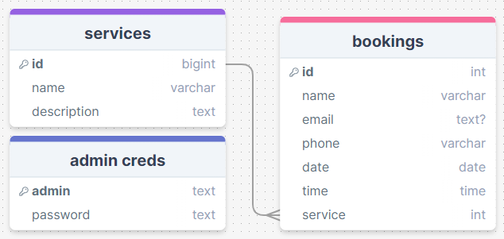

# The Design of a Database-Linked Website for NCEA Level 2

Project Name: **GeoSolutions**

Project Author: **Ben Martin**

Assessment Standards: **91892** and **91893**

-------------------------------------------------

# Design, Development and Testing Log

### 16/05/2024

Made the database layout plan for the site.
 \
Will need to run this past my stakeholder for feedback to make sure the database has all the details required

### DATE HERE

Replace this test with what you are working on

Replace this text with brief notes describing what you worked on, any decisions you made, any changes to designs, etc. Add screenshots / links to other media to illustrate your notes where necessary.

### DATE HERE

Replace this test with what you are working on

Replace this text with brief notes describing what you worked on, any decisions you made, any changes to designs, etc. Add screenshots / links to other media to illustrate your notes where necessary.

### DATE HERE

Replace this test with what you are working on

Replace this text with brief notes describing what you worked on, any decisions you made, any changes to designs, etc. Add screenshots / links to other media to illustrate your notes where necessary.

### DATE HERE

Replace this test with what you are working on

Replace this text with brief notes describing what you worked on, any decisions you made, any changes to designs, etc. Add screenshots / links to other media to illustrate your notes where necessary.

### DATE HERE

Replace this test with what you are working on

Replace this text with brief notes describing what you worked on, any decisions you made, any changes to designs, etc. Add screenshots / links to other media to illustrate your notes where necessary.