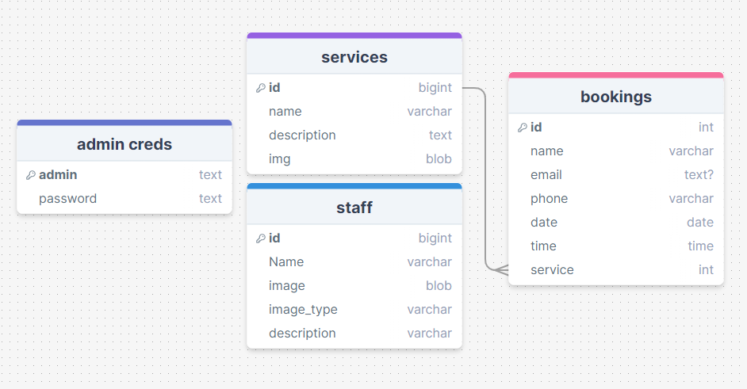
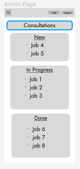
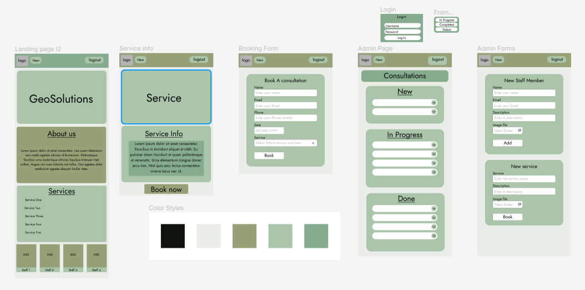
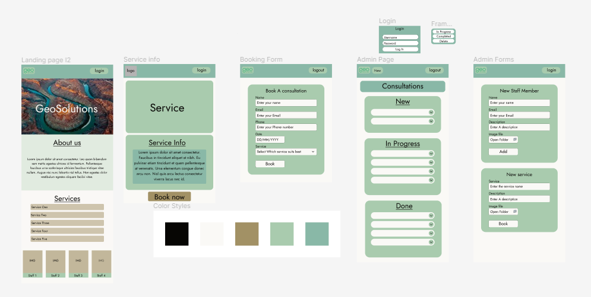

# The Design of a Database-Linked Website for NCEA Level 2

Project Name: **GeoSolutions**

Project Author: **Ben Martin**

Assessment Standards: **91892** and **91893**

-------------------------------------------------

# Design, Development and Testing Log

### 16/05/2024

Made the database layout plan for the site.

Will need to run this past my stakeholder for feedback to make sure the database has all the details required

### DATE HERE

Added a staff table to the database

added a a staff table to the database layout as will need a way to store all their data and their image.

Made a Flow diagram to display how the users will experience the site and what doing what will lead to.

### DATE HERE

Replace this test with what you are working on

Replace this text with brief notes describing what you worked on, any decisions you made, any changes to designs, etc. Add screenshots / links to other media to illustrate your notes where necessary.

### 21/05/24

first two landing page iterations

### 22/05/24
 
further updated the database schema to include an image for the service

### 27/05/24

Showed current layout and wireframe to client.

> Needs an about us section on the home page like in iteration two, but i like the single page layout of the first one with the big GeoSolutions front and centre.

Added a completed bookings table so the bookings can be flagged as completed

then changed it to an enum list so instead of having multiple tables for completed, in progress and unfinished. i can just have one table with an extra slot to contain all that data.

Incorporated CLIENT FEEDBACK AND MADE ONE BIG LANDING PAGE WITH ALL INFORMATION ON IT.
will need to wait for extra feedback before progressing.

### 27/05/24
> admin page looks unprofessional with those big words and dotted list, how am i going to access the new stuff page too?<

Took notes on client feedback and made some changes to V1

mainly in adding a better looking list with smoothed bars and a drop down at the edge to ,ove the items around fromssection to section as well as to deldte them

### 21/05/24
> I like the welcome (home / landing) page – its succinct and includes most of the information needed. An awful lot of people search for us just to find out our phone number of contact email – so it would be great if some contact details were available or linkable from that home page. For the Book a Consultation page – most people who contact us have a project and site in mind and will have a site plan.  Can you add the following fields: site address Upload files: A place where we can ask them to upload a site plan showing the location of the development they’re proposing; or a preliminary design plan;
 

 

I’m not sure we would use the ‘consultation tracker’ – we have in-house software for managing job progress

 

Instead of that, you could possibly have a reviews page?  Or examples page?  Or both?

Reviews would be a place where customers can leave reviews.
Examples – we could upload photos of examples; split into groups
(a) landslip repairs & slope stabilisation

(b) subdivisions

(c) liquefaction assessments etc