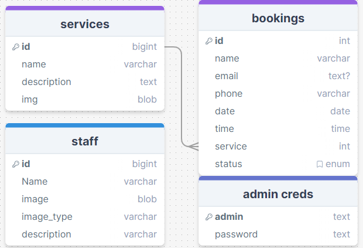
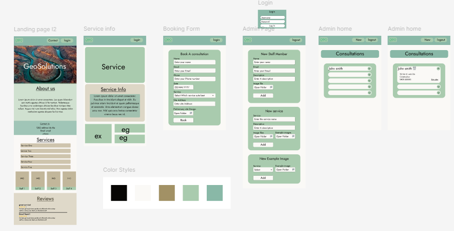
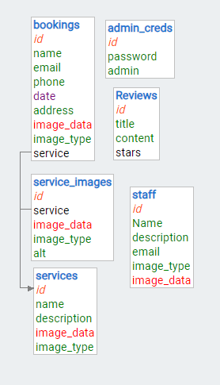
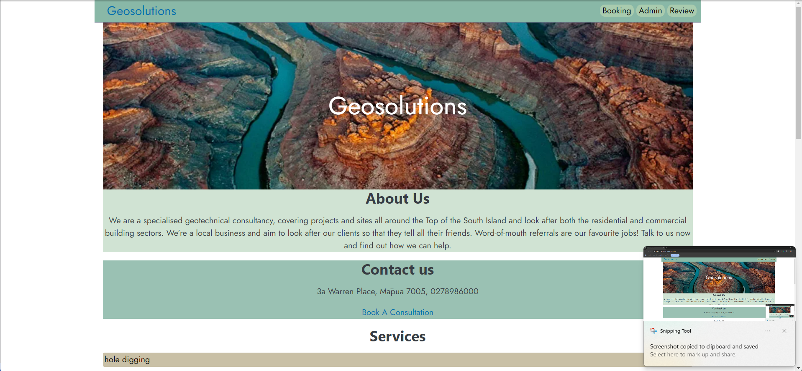
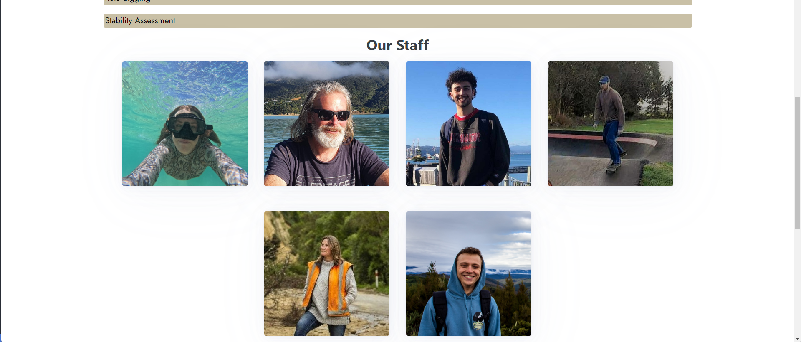
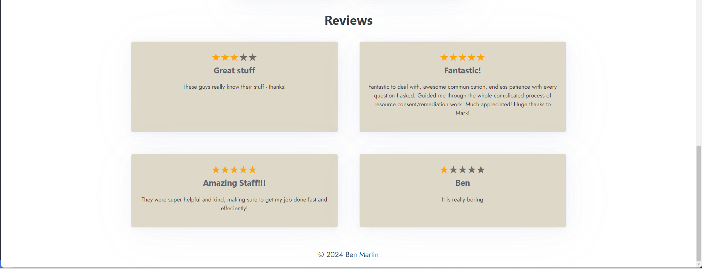

# The Design of a Database-Linked Website for NCEA Level 2

Project Name: **GeoSolutions**

Project Author: **Ben Martin**

Assessment Standards: **91892** and **91893**

-------------------------------------------------

# System Requirements

### Identified Need or Problem

GeoSolutions nz td has a website current;y but the website does not allow them the manage the staff as they come and go, requiring the client to message the website manger every time she needs an update. her current website does not have a place for reviews and example which she would like to have.

### End-User Requirements

GeoSolutions clients are all 20s to 50s professional clientele. This means that any system must use clear and but advanced language. It should be accessible in terms of colours and fonts used. The level of IT expertise of the users could vary from high to very low. This means that the system must be very intuitive to use. the jobs are all earth related, so the system should be nicely designed, possibly with an earth theme.

### Proposed Solution

A website that allows a client to easily apply for a consultation, User should be able to:
- View a list of all the jobs available with a description of each
- make a booking with a dropdown menu for all the job types
- view staff credentials as well as contact details 
- Additionally, the system should:
    - [x] Be very simple to use
    - [x] Be accessible to all
    - [x] Be well designed and a pleasure to use
- for admin they should be able to:
    - [x] View a list of bookings (organised by name, or by date)
    - [x] Add a new job type to the system
    - [x] Add new staff to the system
-------------------------------------------------

# Relevant Implications

### USABILITY

Getting Things Done Quickly and Easily

this is relevant to my project because the website must be easy to use and efficient to use to make the user experience enjoyable

- Follow standard conventions 
- Make the behaviour of the outcome logical and familiar (e.g. page title leads to home page, etc.)
- Provide the end-user with a clear route forwards (and back out, if needed)
- Always make it obvious to the end-user what is happening (e.g. clear titles and loading pages, etc.)
- will need to use lots of testing to make sure it works in all circumstances

### FUNCTIONALITY

Everything Works, and Works Well

Websites must function as intended, so that the user can actually get done what they came there to do, and not take ages doing it.

- Fully satisfy the original need / purpose (e.g. actually be able to make bookings, etc.)
- Fully meet the user's requirements 
- Make sure that it copes with all inputs (normal, boundary and abnormal)
- will need to use lots of testing to make sure it works under all circumstances

### AESTHETICS

Great Designs with Style and Impact

Website must be pleasing to look at so the user can have an enjoyable user experience. as well as being able to easily see wht they're doing and find the elements with no issue. leading lines and frames help.

- Create an overall design that appeals to the end-users (e.g. layout has  curved edges and nice sizing, etc.)
- Create an overall design that is suitable for the outcome's purpose (e.g. icons and pictures that make sense like plants or dirt, etc.)
- Use colours that work effectively together to create a pleasing effect (e.g. have a colour pallet that follows colour theory, etc.)
- Use fonts that work well with the design and convey the business sense
- Position elements of the design in a way that is balanced (e.g. items centred and bordered, etc.)
- Group / separate elements to focus attention and/or link related items

### END USERS

Meets the User's Specific Needs

website must cater to the end users specific needs such as having all the job options explained so they can see which one they need, and having a place to see the certifications of each staff member so that they can know how qualified they all are.

- sculpt the site to suit the proper design conventions of a more mature end user (e.g. modern design, simplistic layout, etc.)
- Use language and other content appropriate to my end-users (e.g. advanced language, no slang, formal, etc.)
- page fully tailored to the stakeholders feedback structured how they want it.
- Ensure it works on a range of devices, especially those likely to be used by the clients (e.g. all images have an alt tag, high contrast all around site, etc.)
- will need to use lots of testing to make sure it suits all circumstances

### LEGALITY

Obey All Relevant New Zealand Laws

website must have exclusive rights to all photos as well as permission to distribute staff details and pictures.

- NZ privacy and data protection laws (e.g. [NZ Privacy Act 1993](https://privacy.org.nz/privacy-act-2020/privacy-principles/))(e.g. make sure that users know that their data is being collected and put into a database for storage, etc.)
- NZ online bullying / harassment laws (e.g. [Harmful Digital Communications Act 2015](https://netsafe.org.nz/what-is-the-hdca/))(e.g. , etc.)
- cover the legal insurance of the GeoSolutions business as well as a terms and conditions page for legal cover
-------------------------------------------------

# User Experiences
 - ### Clear Navigation: 
Will need to ensure easy and intuitive navigation throughout the website. Users should be able to quickly find information about the services offered, the process involved, and how to contact GeoSolutions. Use clear and descriptive labels for navigation items such as "Services," "Process," "Contact Us," etc.

- ### Information Hierarchy:
 Must organize information in a logical hierarchy, prioritizing the most important information. For GeoSolutions, key information such as services offered, the importance of geotechnical reports, and the process involved in obtaining them should be prominently displayed.

- ### Consistent Branding:
 Must remain consistent in branding elements such as logo, colors, and typography across the website. Consistent branding helps in building trust and recognition. Ensure that GeoSolutions' branding is cohesive and reflects the professionalism and reliability of the company.

- ### Responsive Design:
 Must design the website to be responsive across various devices and screen sizes. Many users may access the website from mobile devices, so it's crucial to ensure a seamless experience regardless of the device being used.

- ### User-Friendly Forms:
 If the website includes forms for requesting quotes or contacting GeoSolutions, ensure they are user-friendly and easy to fill out. Minimize the number of required fields and provide clear instructions to avoid user frustration.

- ### Accessible Design:
 Will need to ensure that the website is accessible to users with disabilities. This includes using alt text for images and designing with color contrast in mind. 

-------------------------------------------------

# Final System Design

## Database Structure

Place a image here that shows the  of your database: tables, fields and relationships.

## User Interface Design

Place images here that show your  of your UI: layout, colours, etc.

-------------------------------------------------

# Completed System

## Database Structure

## User Interface Design

Place screenshots and notes here that show your *actual system UI* in action.

-------------------------------------------------

# Review and Evaluation

[Video showing all parts of the review](https://share.vidyard.com/watch/m7QyVnZ2w3nKMocJSLudMp?)

[0:00-0:52 System Requirments]()

[0:52-1:23 Usability and Functionality](https://share.vidyard.com/watch/m7QyVnZ2w3nKMocJSLudMp?autoplay=2&second=52)

[1:23-1:40 Aesthetics](https://share.vidyard.com/watch/m7QyVnZ2w3nKMocJSLudMp?autoplay=2&second=83)

[1:50-1:55 Legality](https://share.vidyard.com/watch/m7QyVnZ2w3nKMocJSLudMp?autoplay=2&second=110)

## Meeting the Needs of the Users

to meet the needs of the end users i made sure to use clear and concise but advanced language. It should be accessible in terms of colours and fonts used. The level of IT expertise of the users varies from high to very low, so i made sure the design very intuitive to use. the jobs are all earth related, so the system should be nicely designed, possibly with an earth theme.

## Meeting the System Requirements

My list of requirements was as follows:
- View a list of all the jobs available with a description of each - services menu on home page.
- make a booking with a dropdown menu for all the job types - booking system implemented with ease of use dropdown
- view staff credentials as well as contact details - no credentials as stakeholder didn't want them in a meeting. 
- Additionally, the system should:
    - [x] Be very simple to use - minimised complexity of site with few pages
    - [x] Be accessible to all - is adjustable to fit phone sizes and has high contrast scale for colour 
    - [x] Be well designed and a pleasure to use - all paths follow a logical route not requiring too many clicks for each page. as well as saving logins to reduce unnecessary redos
- for admin they should be able to:
    - [x] View a list of bookings (organised by name, or by date) - admin home page dis[plays bookings ina minimalist fashion with all the required info at a click]
    - [x] Add a new job type to the system - massive add menu with the ability to add and delete every aspect of the site from services, staff, and images
    - [x] Add new staff to the system

## Review of USABILITY

to address usability in my site and to make it as quick and easy to use as possible while still remaining enjoyable i made sure that i used standard conventions all the wat throughout the site, such as links in the top right, and reviews at the bottom etc.
made sure to keep the site logical and familiar such as making the logo link back to the home page. whenever the user adds or deletes something they're reverted back to the delete page so if the need to delete another thing they can do so with ease without having to make multiple clicks.

## Review of FUNCTIONALITY

to address functionality i my site i made sure that the website functions as intended.
this meant making sure that when the clock on links or pages, they're taken to where they expect without having to wait forever. also being able to quickly open the site place a booking and rest assured that their booking is now in the system without having to worry. i also added input validation for all of the inputs into the site, so if a space was lft empty the form would inform you and make sure that the space is filled out before continuing. also added htmlspecialchars so that if special characters are used in the inputs it doesn't affect the code by converting it into the html special chars syntax and back again

## Review of AESTHETICS

to address the aesthetics aspect of my site i consulted with my stakeholder to make sure we got the best colour scheme that had high contrast while still maintaining a sophisticated professional look of the site. i also made sure to keep everything aligned centrally to help creating leading lines to keep the user focused and interest on the site they're looking at. by keeping all the corners of floating elements rounded it makes the website appear softer and more easier on the eyes that appeals to the end users. the font used is a professional sans serif font that accurately encompass the company style, which is perfect for aesthetics. the flo of the page also follows a logical approach with each elements stacked in a way that the user would want when visiting the site.

## Review of END USERS

to address the end users specific needs i kept the design of the site as mature and professional as possible, i did this by keeping the design modern with a sleek simple design with minimal colours and a serious font. because my clientele are all advanced geologists or clients for a high level business i made sure to keep all the language used in the site as formal and advanced as is relevant. by taking in stakeholder feedback wherever possible i was able to improve the site such as adding reviews section and the specialist drop down for each components.

## Review of LEGALITY

To address the legality of my site i made sure that all the pictures used were allowed for public use. to make sure of the i filtered images by creative commons license.
 on my bookings page i added a disclaimer that informs the user about the nz privacy act 1993. this ells them that their data is being stored and that it will be manged safely. because the reviews are public there is chance that someone may post harassment comments on the site. this is why i added the ability to delete reviews. if an admin disproves of a review they can delete it to be accordant with all lws

